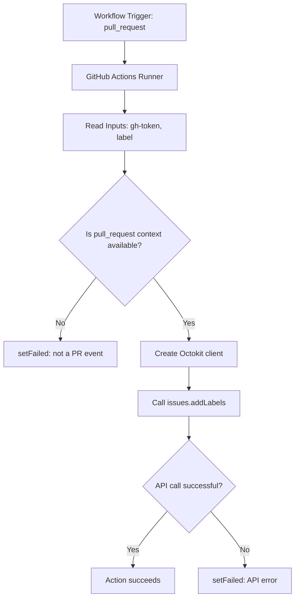

# Pull Requests Labeling Action

Automatically adds a label to pull requests.

## Why use this action?

- Enforces consistent PR triage across repositories.
- Reduces manual labeling work for maintainers.
- Enables downstream automation based on labels (review routing, alerts, release gates).

## Inputs

| Input      | Required | Description                                                  |
| ---------- | -------- | ------------------------------------------------------------ |
| `gh-token` | Yes      | GitHub token with permission to add labels on pull requests. |
| `label`    | Yes      | Label name to apply to the pull request.                     |

## Usage

### Recommended (major tag)

```yaml
name: Label PRs

on:
  pull_request:
    types: [opened, reopened, synchronize]

jobs:
  label:
    runs-on: ubuntu-latest
    permissions:
      pull-requests: write
    steps:
      - name: Apply label to PR
        uses: OmarChouchane/Typescript-Github-Action@v1
        with:
          gh-token: ${{ secrets.GITHUB_TOKEN }}
          label: needs-review
```

### Fully pinned (exact release)

```yaml
uses: OmarChouchane/Typescript-Github-Action@v1.0.1
```

## Behavior

- Works only for pull request events.
- Adds the configured label to the current PR.
- Fails the step with a clear message if the event is not a PR or if the API call fails.

## Architecture



- Trigger source: workflow `pull_request` event.
- Decision gate: validates PR context before API usage.
- External dependency: GitHub REST API via Octokit.
- Failure handling: all errors end in `setFailed(...)`.

## Local development

```bash
npm install
npm run build
npm test
```

Build output is generated in `dist/` and the action entrypoint is `dist/index.js`.

## Troubleshooting

- **Action fails with token/auth error**
  - Ensure `gh-token` is set and has label write permissions.
- **Action says it can only run on pull requests**
  - Confirm your workflow trigger uses `pull_request`.
- **Label is not added**
  - Verify the label exists in the repository, or ensure your process allows creating labels if needed.
